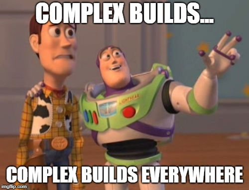
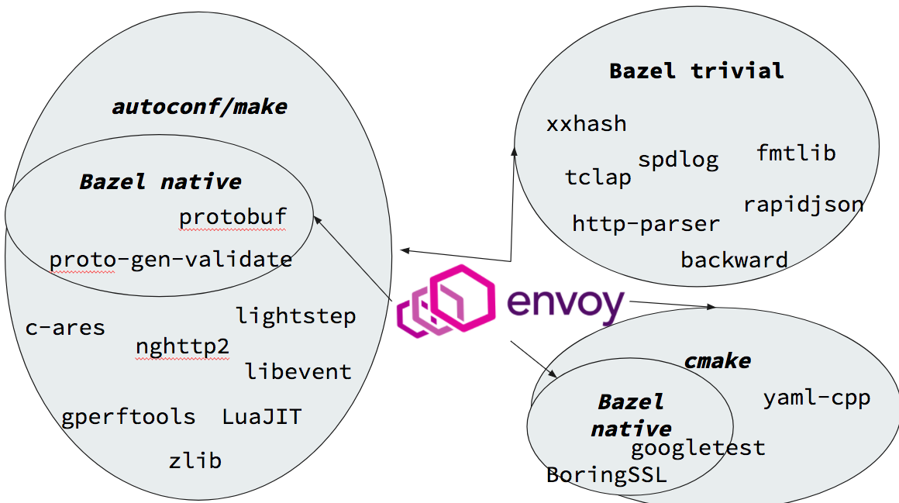

## Bincrafters
*Your Open-Source Devops Team for Conan and C/C++*  

---
### Find Us Online

* https://opencollective.com/bincrafters
* https://bincrafters.github.io
* https://twitter.com/bincrafters
* https://github.com/bincrafters

---
### About Me

Jerry Wiltse
* Twitter and Github: @solvingj
* Software Developer, Mechanical Simulation Corp.
* Former Infrastructure Engineer
* Groovy, Java, C#, C++
* Active in numerous local community meetups

---
### Many Thanks
* Conan and JFrog Teams
* TravisCI, Appveyor, CircleCI
* OpenCollective
* Contributors and Donors
* Early Conan Packagers

---
### Current Package Highlights
* C++ : 
	* boost, fmt, zstd, asio, cpprestsdk, wt
	* rxcpp, actor-framework, zmq
* C : 
	* libssh2, libcurl, libevent, libuv, 
	* icu, libiconv, libwebsockets, rapidjson, libxml2

---
### Current Package Highlights
* test+log: 
	* catch, glog, gtest, log4cplus, spdlog
* crypto: 
	* libsodium, crypto++, botan, mbedTLS

---
### Current Package Highlights
* graphics: 
	* jpeg, png, tiff, gif, webp, imgui
	* qr, glm, glfw, glew, glad, ffmpeg*
* audio codecs: 
	* mp3, ogg, vorbis, opus, flac, openal

---
### Current Package Highlights
* installers: 
	* bazel, gyp, ninja, ragel
	* nasm, yasm, depot_tools, doxygen
* subsystems: 
	* cygwin and msys2

---
### History and Motivation

---
### The Conditions
* Recently acquired by JFrog, team **swamped** with 1.0
* Updated boost package was highly demanded
* Naive and Idealistic Premise: 1 Library, 1 Package
* Boost 130+ separate libraries
* Complex dependency tree
* The poster child for a package manager like Conan
* Great set of "seed libraries" for a central repo

---
### Star alignment
* @uilianries, Conan contributor, helped me learn
* Recognized @grafikrobot as Rene Rivera in #conan
* @SSE4, @tomskside : Konstantin Ivlev, prominent community member
* @stathis @sigmoidal : Efstathios Stavrakis, providing major binaries for years
* Conan team support and encouragement

---
### More Contributors
* @tszelei @sztomi, Tamas Selei
* @theodelriu, Theo Delriu
* @thierix, Evgeney Seliverstov
* @ZaMaZaN4iK, Alexander Zaitsev
* @jgsogo, Javier G. Sogo
* @dimi309, Dimitri Kourkoulis
* @r-darwish, Roey Darwish Dror
* @drrlvn, Dror Levin

---
### More Contributors
* @mro, Matheiu Ropert
* @sourcedelica, Eric Pederson
* @wi3rd, Alex Kucher
* @AlexanderPJT, Alexandre Petitjean
* @NinjaDaro, DariuszOstolski
* @eliaskousk, Elias Kouskoumvekakis
* @fornever, Friedrich von Never
* @GamePad64, Alexander Shishenko 
* @fmorgner, Felix Morgner
* @DEGoodmanWilson, Don Goodman-Wilson

---
### What we set out to do
* Use Conan to package Boost libraries a-la-carte
* Demonstrate a large dependency tree in Conan
* Demonstrate the transformative nature of Conan

---
### What we ended up doing
* 250+ Packages, Windows + Linux + macOS
* MSVC + GCC + Clang + Apple-Clang
* 32/64 x Debug/Release x 3 versions x MT/MD/MTd
* Blog, Twitter, Docs, BPT (pypa), Docker Images

---
### Beyond the Stats
* Attract large group of significant contributors
* Establish numerous standards and guidelines
* Help usher new community members and authors
* Tight feedback loop with Conan team
* Submitted many PR's for Conan and CPT
* Obtain sponsorship for CI capacity
* Informative blog posts and documentation

---
### Why keep going 

---
### Envoy - A Poster Child
* Read this article
https://blog.envoyproxy.io/external-c-dependency-management-in-bazel-dd37477422f5
* Modern Build System
* Highly-Popular Project
* Brilliant Team
* Extremely complicated build story
* Fundamental problem: lacks critical abstraction

---
### Envoy -  A Visual Perspective

---
### Why keep going 

---
### Why keep going 
* Conan OSS forces developers to learn
* Includes several levels of understanding...
	* native software
    * build systems
	* compilers
	* strategies
	* dependency management

---
### Why keep going 
* Our members continue to need new libraries
* Several Members use Conan in Enterprise
	* Different
	* Substantially more complex
	* Includes MORE levels of understanding...
	
---
### Why keep going 
* "Enterprise" conan factors 
	* Unique architectures, platforms, compilers
	* Different CI, constant rebuilding
	* Not semantic versioning, "live at head"
	* Merging with existing devops
    * Phased implementations of Conan
	* OSS package customization

---
### Why keep going 
* Our experience is invaluable to SG15
* Unique real-world experience
* Started with simple cases of OSS + Enterprise 
* Also worked in many dark corners
	- Tool-to-tool integrations
	- Long-term maintainability challenges

---
### Why keep going 
* The Conan team can't possibly do it all
* So much work to do
* It feels good: 
	* Using the right tool to solve problems

---
### Bincrafters Future Goals
* Conan goals
* Related project
* Funding goals

---
### Conan and Package Tools
* Modular Qt, OpenCV, FFMPeg 
* Submit features to Conan and CPT
	* Help test/validate experimental features
		* Conan "Project" concept
		* New package versioning behavior
	* Try to create and submit features we want
		* Package sources with package
		* Export to OS package (deb, rpm, nupkg, brew)
		* Interop with other package managers

---
### Future Goals : Related Projects 
* Projects to Streamline Large-Scale CI
* Discovered substantial OSS bottlenecks at scale
* We have to solve them, countless others can benefit

---
### Visual Studio Extension
* Visual Studio dominates C/C++ market
* Still numerous rough edges around Conan UX
* Currently have pre-alpha version on Github
* Lots of room for easy wins, everything automatic:
	* IDE-Driven workflow
	* Call Conan when needed
	* Pass all needed options and settings
---
### Domino - Universal CI Dependencies
* Upstream library release trigger downstream CI 
	* downstream dependency libraries
	* downstream package manager repos
	* flexible build policies for downstream consumers 
* Greatly needed in both OSS and Enterprise
* Like Libraries.io - action rather than emails
* Low difficulty, extremely high reward

---
### CI Anywhere - Generic CI Middleware
* Inspired by Conan Package Tools
* Mitigate CI lock-in
* Run full builds locally on developer machine
* Implement new CI features faster: 
	* First-class docker integration
	* Project-level dependencies
* More advanced commit parsing and "build policies"
* Later, better integration with CI providers via plugins

---
### Move CI to Jenkins/macStadium
* Our process is highly abusive and inefficient
	* Mostly bandwidth
* Massive transfer between CI and bintray
	* Superprojects are the problem
	* Currently Boost, every release
	* Future super-projects : Qt, Etc. 
* macStadium : for legitimate macOS 

---
### CI Load Specifics
* 12 x 6 = 72 windows builds
* 6 x 8 = 48 linux builds
* 4 x 3 = 12 macOS builds	

---
  
(Like 1000 builds)

---
### Our Usage - Unique Characteristics 
* For each of the **132** builds....
	* Pull all conan dependencies from Bintray
	* Pushes binaries back to Bintray
* 7+ massive images from dockerhub
	* hopefully cached
	* Update Conan + CPT each build
* Again, extremely abusive and inefficient
	
---
### Bincrafters : Seeking Funding
* Seeking substantial OSS grants
	* Recurring : MacStadium resources: ~$900 / month
	* Recurring : Full-Time Committer Salary
	* First project : Domino
* Inspired/Encouraged by PYPA team 
* Several existing/known OSS grant programs
 * Close but not perfect for Bincrafters
	 
---
### Closing : A Deeper Perspective 
* Impelementing critical abstraction layer for interop
* Encapsulating build-system complexity per-project
* Running CI and pre-building binaries is crucial step 
* Blazing new trail for all native code
	
---
### References
* Blog : https://bincrafters.github.io
* Docs : https://bincrafters.readthedocs.io
* Github and Twitter : @bincrafters

* Envoy Proxy Dependencies : 
https://blog.envoyproxy.io/external-c-dependency-management-in-bazel-dd37477422f5

* Kenneth Hoste : 
Youtube : How to make package managers cry